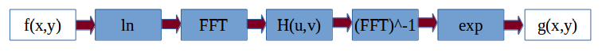
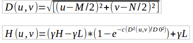
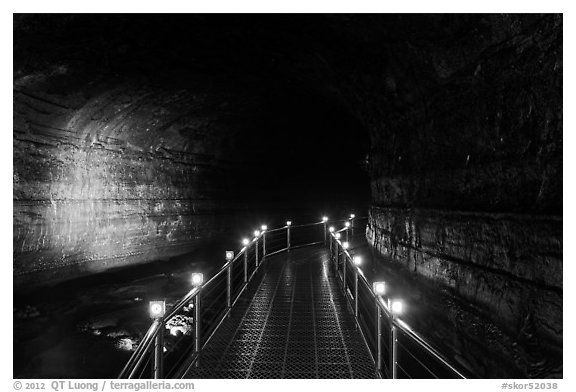
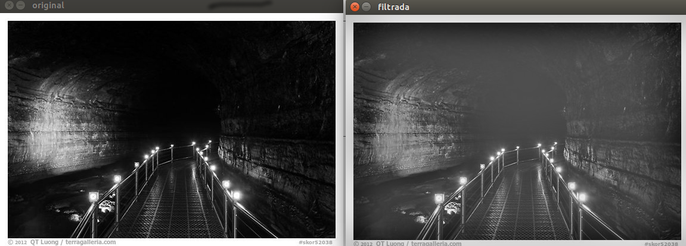
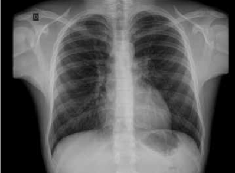
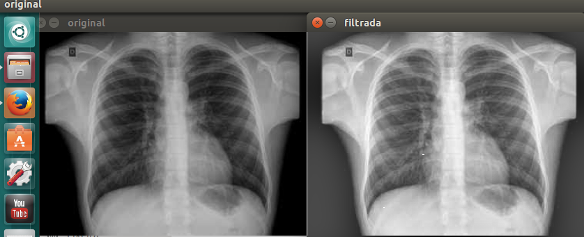

= Filtragem no domínio da frequência
:Author:    Victor Mafra e Angele Louise
:Email:     <angelealst@hotmail.com e vick.vems@gmail.com>
:toc: left

== Q.1

Utilizando o programa exemplos/dft.cpp como referência, implemente o filtro homomórfico para melhorar imagens com iluminação irregular. 
Crie uma cena mal iluminada e ajuste os parâmetros do filtro homomórfico para corrigir a iluminação da melhor forma possível. Assuma que a imagem fornecida é 
em tons de cinza.

    É um tipo de filtragem que se baseia nos componentes de iluminação e reflectância. É útil na melhora da aparência de imagens através de compressão de intervalo de brilho e realce de contraste simultâneos.

    A abordagem da filtragem homomórfica pode ser representada pelo seguinte fluxo grama.
    

	Para a construção o programa dft.cpp fornecido pelo professor foi usado como base.
	O programa homomorphicFilter é composto por 3 funções além da principal. Sendo elas void deslocaDFT(Mat&), void homomorphicFilter() e void testArgs(char).
    As variáveis são todas globais, portanto podem ser acessadas por qualquer função sem que sejam passadas por parâmetro.
	Basicamente a função principal tem objetivo de obter parâmetros de quantidade de linhas e colunas para a utilização otimizada do método de transformada discreta de Fourrier(DFT). Para isso a imagem passada tem suas colunas e linhas verificadas através do método getOptimalDFTSize(int) cujo retorno se trata da melhor magnitude das componentes citadas. Uma nova matriz é criada com o tamanho da imagem original mais o padding(imagem completada com zeros para que suas dimensões sejam ótimas) que servirá para que os valores do filtro sejam alocados, já que o filtro deve possuir tamanho idêntico ao da imagem pós padding.
	Na função homomorphicFilter() o código principal está contido em um laço, que tem sua quebra decidida pelo usuário (veja mais detalhes posteriormente). O primeira coisa a ser executada dentro da função é o cálculo do filtro homomórfico, cujos valores iniciais das variáveis gama high(gH), gama low(gL), Do e c são respectivamente  2.0, 0.5, 8, 1 (foram os valores adotados pelo professor, e também adotados nesse programa com finalidade de checar se o programa foi bem sucedido ao obter os mesmos resultados na mesma imagem e de criar limites superior e inferior para o valor das variáveis). 
    A fórmula adotada para o filtro homomórfico foi: 

	Os próximos passos são caracterizados pela construção da parte real e imaginária da imagem original pós padding. É realizado o procedimento de transformada e em seguida seus quadrantes são trocados na função void deslocaDFT(Mat&). O filtro é aplicado a imagem seus quadrantes são novamente trocados, há a transformada inversa de Fourrier resultando em uma imagem com dois canais. O canal resultante com valores reais é normalizado e exibido na tela.
	Essa ação se repete ao apertar qualquer tecla exceto 'esc'. Para as teclas 'h', 'H', 'l', 'L', 'c', 'C', 'd', 'D' existem ações avaliadas pela função void testArgs(char). Para os caracteres maiúsculos há acréscimo no valor da variável, para os minúsculos há decréscimo. Os valores de acréscimo e decréscimo são diferentes para as variáveis, sendo de 0.5 para Do('d' e 'D') e c('c' e 'C') e de 0.1 para   gama low('l' e 'L') e gama high('h' e 'H'). Os limites foram escolhidos arbitrariamente e são:
    Do: 0.5 ~ 20
    c: 1 ~ 10
    gH: gL+1 ~ 14
    gL: 0.1 ~ gH-1
	Foram realizados testes em duas imagens, uma mostra o interior de uma caverna com uma passarela iluminada mas com paredes escuras e a segunda se trata de um raio-x. Em ambas as imagens após os filtros mais detalhes puderam ser observados. Na caverna detalhes nas rochas das paredes laterais que eram mais escuras na imagem original se tornaram mais evidentes e no raio-x houve um aumento na nitidez e contraste, possibilitando a melhor visualização do que é osso e do que não é osso, as veias e artérias se tornaram mais evidentes também. 
    Abaixo segue o valor dos parâmetros usados (ao serem modificados pelo teclado são mostrados no console).

	Para a foto da caverna o melhor ajuste foi:
    gH: 2.899999 <> gL: 0.500000 <> c: 10.500000 <> Do: 10.000000

	Para a foto do raio-x o melhor ajuste foi:
    gH: 14.000000 <> gL: 7.699995 <> c: 1.000000 <> Do: 3.000000

== Código

[source,c]
----------------------------
#include <iostream>
#include <opencv2/opencv.hpp>
#include <cmath>
#include <opencv2/imgproc/imgproc.hpp>

#define RADIUS 20

using namespace cv;
using namespace std;

  VideoCapture cap;
  Mat imaginaryInput, complexImage, multsp;
  Mat padded, filter, mag;
  Mat image, imagegray, tmp;
  Mat_<float> realInput, zeros;
  vector<Mat> planos;
  float gH,gL,Do,c;
  double radius;
  char TrackbarName[50];
   // valores ideais dos tamanhos da imagem
  // para calculo da DFT
  int dft_M, dft_N;
  // guarda tecla capturada
  char key;
  bool novoTeste;
  
  void testArgs(char key);
  
  
  // troca os quadrantes da imagem da DFT
void deslocaDFT(Mat& image ){
  Mat tmp, A, B, C, D;
  // se a imagem tiver tamanho impar, recorta a regiao para
  // evitar cópias de tamanho desigual
  image = image(Rect(0, 0, image.cols & -2, image.rows & -2));
  int cx = image.cols/2;
  int cy = image.rows/2;

  // reorganiza os quadrantes da transformada
  // A B   ->  D C
  // C D       B A
  A = image(Rect(0, 0, cx, cy));
  B = image(Rect(cx, 0, cx, cy));
  C = image(Rect(0, cy, cx, cy));
  D = image(Rect(cx, cy, cx, cy));

  // A <-> D
  A.copyTo(tmp);  D.copyTo(A);  tmp.copyTo(D);

  // C <-> B
  C.copyTo(tmp);  B.copyTo(C);  tmp.copyTo(B);
}

void homomorphicFilter(){
	for(;;){
			  // prepara filtro homomórfico
		  for(int i=0; i<dft_M; i++){
			for(int j=0; j<dft_N; j++){
				radius = (double) (i-dft_M/2)*(i-dft_M/2)+(j-dft_N/2)*(j-dft_N/2);
				tmp.at<float> (i,j) = (gH-gL)*(1-exp(-c*(radius/pow(Do,2))))+gL;
			}
		  }

		  // cria a matriz com as componentes do filtro e junta
		  // ambas em uma matriz multicanal complexa
		  Mat comps[]= {tmp, tmp};
		  merge(comps, 2, filter);
	  
		// realiza o padding da imagem
		copyMakeBorder(image, padded, 0,
					   dft_M - image.rows, 0,
					   dft_N - image.cols,
					   BORDER_CONSTANT, Scalar::all(0));

		// limpa o array de matrizes que vao compor a
		// imagem complexa
		planos.clear();
		// cria a compoente real
		realInput = Mat_<float>(padded);
		// insere as duas componentes no array de matrizes
		planos.push_back(realInput);
		planos.push_back(zeros);

		// combina o array de matrizes em uma unica
		// componente complexa
		merge(planos, complexImage);

		// calcula o dft
		dft(complexImage, complexImage);

		// realiza a troca de quadrantes
		deslocaDFT(complexImage);

		// aplica o filtro frequencial
		mulSpectrums(complexImage,filter,complexImage,0);

		// limpa o array de planos
		planos.clear();
		// separa as partes real e imaginaria para modifica-las
		split(complexImage, planos);

		// recompoe os planos em uma unica matriz complexa
		merge(planos, complexImage);

		// troca novamente os quadrantes
		deslocaDFT(complexImage);

		cout << complexImage.size().height << endl;
		// calcula a DFT inversa
		idft(complexImage, complexImage);

		// limpa o array de planos
		planos.clear();

		// separa as partes real e imaginaria da
		// imagem filtrada
		split(complexImage, planos);

		// normaliza a parte real para exibicao
		normalize(planos[0], planos[0], 0, 1, CV_MINMAX);
		imshow("filtrada", planos[0]);
			printf("gH: %f <> gL: %f <> c: %f <> Do: %f \n",gH,gL,c,Do);
		
		 key = (char) waitKey(0);
		if( key == 27 ) 
			break;
		
		testArgs(key);
	}
	
}

int main(int argc, char**argv){
  
  // captura uma imagem para recuperar as
  image= imread(argv[1],CV_LOAD_IMAGE_GRAYSCALE);
  //mostra imagem original
  imshow("original", image);
  
  // ganho inicial do ruido
  gH=2.0;
  gL=0.5;
  Do=8;
  c=1;
  
  printf("Ref gH: %f <> gL: %f <> c: %f <> Do: %f \n",gH,gL,c,Do);
  
  // identifica os tamanhos otimos para
  // calculo do FFT
  dft_M = getOptimalDFTSize(image.rows);
  dft_N = getOptimalDFTSize(image.cols);

  // realiza o padding da imagem
  copyMakeBorder(image, padded, 0,
                 dft_M - image.rows, 0,
                 dft_N - image.cols,
                 BORDER_CONSTANT, Scalar::all(0));

  // parte imaginaria da matriz complexa (preenchida com zeros)
  zeros = Mat_<float>::zeros(padded.size());

  // prepara a matriz complexa para ser preenchida
  complexImage = Mat(padded.size(), CV_32FC2, Scalar(0));

  // a função de transferência (filtro frequencial) deve ter o
  // mesmo tamanho e tipo da matriz complexa
  filter = complexImage.clone();

  // cria uma matriz temporária para criar as componentes real
  // e imaginaria do filtro ideal
  tmp = Mat(dft_M, dft_N, CV_32F);
  homomorphicFilter();
  return 0;
}

void testArgs(char key){
	novoTeste=true;
	switch(key){
      // aumenta o c
    case 'C':
     c=c+0.5;
      if(c > 15)
        c=10;
      break;
      // diminui o c
    case 'c':
      c=c-0.5;
      if(c<1)
		 c=1;
      break;
       // aumenta o Do
    case 'D':
      Do += 0.5;
	  if(Do > 20)
        Do=20;
      break;
       // diminui o Do
    case 'd':
      Do -= 0.5;
      if(Do < 0.5)
        Do=0.5;
      break;
	    // aumenta o gama High
    case 'H':
      gH += 0.1;
	  if(gH > 14)
        gH=14;
      break;
	  // diminui o gama High
    case 'h':
      gH -= 0.1;
	  if(gH < gL+1)
        gH=gL+1;
      break;
	 case 'L':
      gL += 0.1;
	  if(gL > gH-1)
        gL=gH-1;
      break;
	  // diminui o gama High
    case 'l':
      gL -= 0.1;
	  if(gL < 0.1)
        gL=0.1;
      break;
    }
}

----------------------------

.Original

.Filtro

.Original

.Filtro

link:index.html[Voltar]