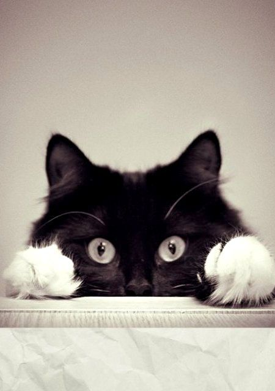
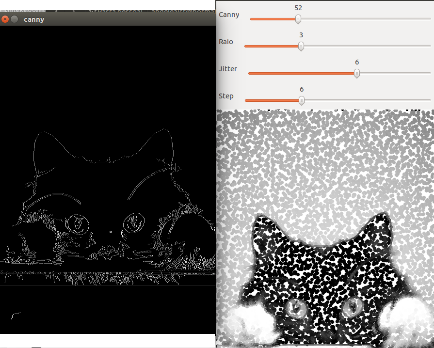

= Canny e a arte com pontilhismo

== Q.1
    Utilizando os programas exemplos/canny.cpp e exemplos/pontilhismo.cpp como referência, implemente um programa cannypoints.cpp. A idéia é usar as bordas produzidas pelo algoritmo de Canny para melhorar a qualidade da imagem pontilhista gerada. A forma como a informação de borda será usada é livre. Entretanto, são apresentadas algumas sugestões de técnicas que poderiam ser utilizadas:

       - Desenhar pontos grandes na imagem pontilhista básica;

       - Usar a posição dos pixels de borda encontrados pelo algoritmo de Canny para desenhar pontos nos respectivos locais na imagem gerada.

       - Experimente ir aumentando os limiares do algoritmo de Canny e, para cada novo par de limiares, desenhar círculos cada vez menores nas posições encontradas. A Figura Pontilhismo aplicado à imagem Lena foi desenvolvida usando essa técnica.
    Escolha uma imagem de seu gosto e aplique a técnica que você desenvolveu.
    Descreva no seu relatório detalhes do procedimento usado para criar sua técnica pontilhista.
	
== Resposta:

===================
Nesta atividade usaremos as bordas de Canny como referência para desenhar o pontilhismo. Utilizando da função do OpenCV:
===================

[source,c]
----------------------
void findContours(InputOutputArray image, OutputArrayOfArrays contours, OutputArray hierarchy, int mode, int method, Point offset=Point())
(retirado da biblioteca OpenCV)
	Parameters:	
    - image – Source, an 8-bit single-channel image. Non-zero pixels are treated as 1’s. Zero pixels remain 0’s, so the image is treated as binary . You can use compare() , inRange() , threshold() , adaptiveThreshold() , Canny() , and others to create a binary image out of a grayscale or color one. The function modifies the image while extracting the contours. If mode equals to CV_RETR_CCOMP or CV_RETR_FLOODFILL, the input can also be a 32-bit integer image of labels (CV_32SC1).
    - contours – Detected contours. Each contour is stored as a vector of points.	
    - hierarchy – Optional output vector, containing information about the image topology. It has as many elements as the number of contours. For each i-th contour contours[i] , the elements hierarchy[i][0] , hiearchy[i][1] , hiearchy[i][2] , and hiearchy[i][3] are set to 0-based indices in contours of the next and previous contours at the same hierarchical level, the first child contour and the parent contour, respectively. If for the contour i there are no next, previous, parent, or nested contours, the corresponding elements of hierarchy[i] will be negative.
----------------------

.Codigo

[source,c]
------------------------
#include <iostream>
#include "opencv2/opencv.hpp"

using namespace std;
using namespace cv;

#define RAIO_MAX 10
#define JITTER_MAX 10
#define STEP_MAX 20

int top_slider = 70;
int top_slider_max = 200;
int raio_slider = 3;
int jitter = 3;
int step = 5;
int width, height;

char TrackbarName[50];

Mat image, border, points;

void on_trackbar_pontilhismo(int, void*) {

  vector<int> yrange;
  vector<int> xrange;
  int width, height;
  uchar gray;
  int x, y;

  width=image.size().width;
  height=image.size().height;

  xrange.resize(height/step);
  yrange.resize(width/step);

  iota(xrange.begin(), xrange.end(), 0);
  iota(yrange.begin(), yrange.end(), 0);

  for(uint i=0; i<xrange.size(); i++){
    xrange[i]= xrange[i]*step+step/2;
  }

  for(uint i=0; i<yrange.size(); i++){
    yrange[i]= yrange[i]*step+step/2;
  }

  points = Mat(height, width, CV_8U, Scalar(255));

  random_shuffle(xrange.begin(), xrange.end());

  for(auto i : xrange){
    random_shuffle(yrange.begin(), yrange.end());
    for(auto j : yrange){
      x = i+rand()%(2*jitter)-jitter+1;
      y = j+rand()%(2*jitter)-jitter+1;
      gray = image.at<uchar>(x,y);
      circle(points,
             cv::Point(y,x),
             raio_slider,
             CV_RGB(gray,gray,gray),
             -1,
             CV_AA);
    }
  }

  vector<vector<Point>> contornos;
  vector<Vec4i> hierarquia;
  findContours(border, contornos, hierarquia, CV_RETR_TREE, CV_CHAIN_APPROX_NONE);
  for (int i = 0; i < contornos.size(); i++){
    for (int j = 0; j < contornos[i].size(); j++) {
      gray = image.at<uchar>(contornos[i][j].y, contornos[i][j].x);
      circle(points, cv::Point(contornos[i][j].x, contornos[i][j].y),
      1,
      CV_RGB(gray, gray, gray),
      -1,
      CV_AA);
    }
  }

  imshow("cannypoints", points);
  imshow("canny", border);

}

void on_trackbar_canny(int, void*){ //canny
  Canny(image, border, top_slider, 3*top_slider);
  on_trackbar_pontilhismo(top_slider, 0);

}

int main(int argc, char**argv){

  image= imread(argv[1],CV_LOAD_IMAGE_GRAYSCALE);
  
  width=image.size().width;
  height=image.size().height;

  sprintf( TrackbarName, "Canny");

  namedWindow("cannypoints",1);
  createTrackbar( TrackbarName, "cannypoints",
                &top_slider,
                top_slider_max,
                on_trackbar_canny );

  sprintf( TrackbarName, "Raio");
  createTrackbar( TrackbarName, "cannypoints",
                  &raio_slider,
                  RAIO_MAX,
                  on_trackbar_pontilhismo );

  sprintf( TrackbarName, "Jitter");
  createTrackbar( TrackbarName, "cannypoints",
                  &jitter,
                  JITTER_MAX,
                  on_trackbar_pontilhismo );

  sprintf( TrackbarName, "Step");
  createTrackbar( TrackbarName, "cannypoints",
                  &step,
                  STEP_MAX,
                  on_trackbar_pontilhismo );

  on_trackbar_canny(top_slider, 0 );

  waitKey();
  return 0;
}
------------------------

.Original

.Pontilhismo

link:index.html[Voltar]