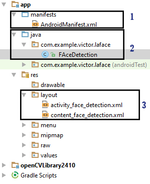
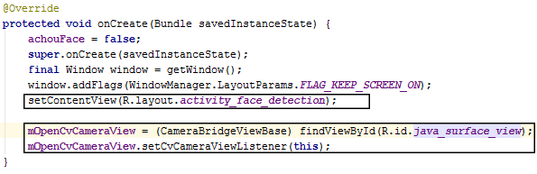
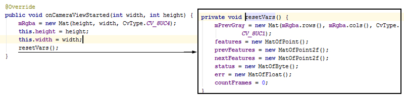
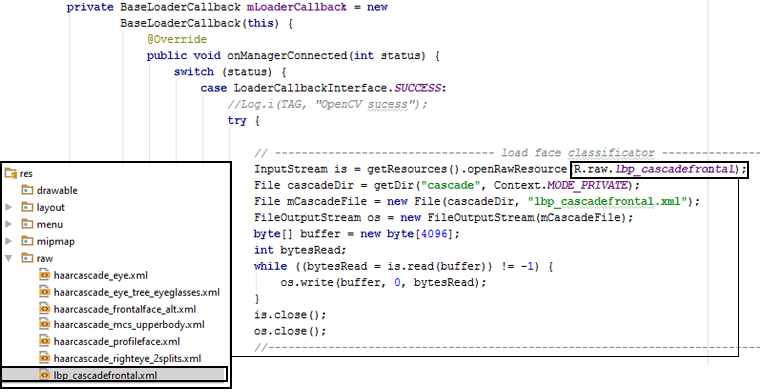
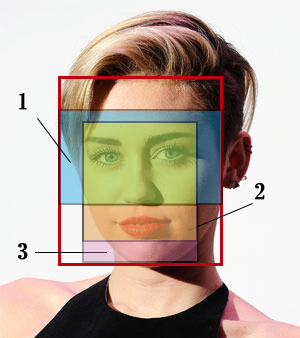
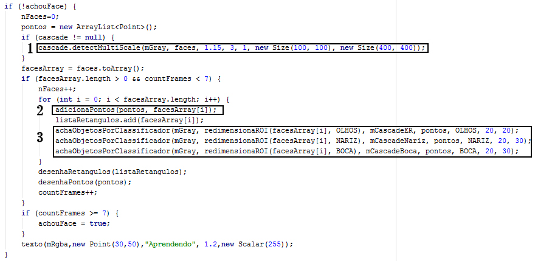
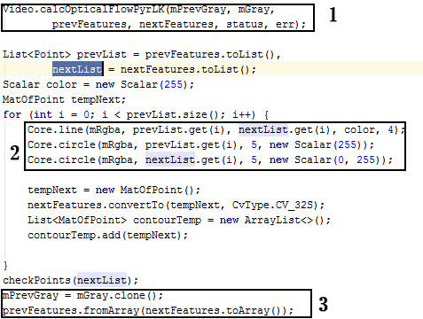

= APLICATIVO ANDROID DE DETECÇÃO E RASTREAMENTO DE FACE HUMANA EM TEMPO REAL UTILIZANDO OPENCV
:Author:    Victor Mafra e Angele Louise
:Email:     <angelealst@hotmail.com e vick.vems@gmail.com>

== 1. INTRODUÇÃO
O seguinte trabalho trata sobre experiência realizada em plataforma Android com finalidade de desenvolver um aplicativo para detecção e rastreamento de faces em tempo real utilizando OpenCV(biblioteca multiplataforma de computação visual) para o processamento de vídeo. Para detectar faces foi feito uso de classificadores do tipo LBP e Haar e para o rastreamento o método de Lucas-Kanade, que são recursos oferecidos pela biblioteca supracitada. 
Tal trabalho foi feito com o objetivo de adquirir conhecimento na área assim como atender as demandas acadêmicas do terceiro período da disciplina de processamento digital de imagens em 2016.1 do curso de Engenharia de Computação/UFRN.

== 2. PROGRAMAS E FERRAMENTAS UTILIZADAS

O ambiente de desenvolvimento utilizado foi o Android Studio versão 1.5.1, que é o oficial para desenvolvimento em Android. Para o desenvolvimento das funções de reconhecimento e rastreio foram usadas as bibliotecas do OpenCV(API de visão computacional) na versão 2.4.10 baixadas do site. Para o funcionamento do aplicativo no dispositivos foi necessário baixar do Google Play o OpenCV Manager, que são as bibliotecas necessárias para o funcionamento correto dos aplicativos publicados e que fazem uso de funções do OpenCV. Essa dependência existe visando o menor tamanho dos aplicativos, de tal forma que nenhum deles carregam as bibliotecas em seu código. Os testes foram realizados em 3 dispositivos: Tablet Nexus 7, Lenovo A7010 e Morotola Moto G 2ªgen.
    
== 3. CONTEÚDO TEÓRICO

O conteúdo desenvolvido no experimento aborda algoritmos já conhecidos para detecção de faces e rastreio. De modo que foram utilizados classificadores do tipo LBP e Haar, assim como método da pirâmide para rastreamento, essa sessão tratara acerca desses algoritmos.

=== 3.1. ALGORITMO DE VIOLA-JONES

É o primeiro que oferece taxas de detecção de objetos competitivas em tempo real, proposto em 2001 por Paul Viola e Michael Jones. Apesar do algoritmo ter capacidade de receber treinamento para detectar qualquer objeto, seu principal objetivo atualmente é a detecção de faces.
O algoritmo possui uma característica importante, ele apenas distingue as faces das não-faces, ele não as reconhece. Outras características importantes são: a sua robustez, possui uma alta taxa de positivos e uma baixa taxa de falsos positivos e ocorre em tempo real. 

O algoritmo possui 4 estágios:

==== 3.1.1. Seleção Haar feature:

Este método utiliza-se de unidades chamadas _features_ retangulares, eles possuem quatro padrões possíveis e formatos específicos, entretanto podem possuir dimensões e posições arbitrárias dentro de uma janela também arbitrária, o calculo do valor dessas unidades se dá pela diferença entre as somatórias dos _pixels_ na região preta e dos _pixels_ na região branca.

.Configuração de uma feature.
image::imagens_final/feature.PNG[]
 
*Haar features* partem do pressuposto que todas as faces compartilham de propriedades similares, são elas: A região dos olhos, que é mais escura que a região acima das bochechas; A região do nariz, que é mais clara que a região dos olhos; Localização dos olhos, nariz e boca por proporção.

.Sobreposição de features em uma face.
image::imagens_final/face.PNG[]

==== 3.1.2. Criação de uma imagem integral:

Para acelerar o cálculo do valor de um feature sobre uma imagem, é necessário usá-la na representação integral, que é o cálculo do somatório de todos os pixels ao redor de um pixel em específico, como pode ser visto na imagem abaixo.

.Imagem integral
image::imagens_final/imagem.PNG[]

O valor da imagem integral no ponto 1 é a soma dos pixels de A, enquanto que o ponto 2 é A+B, o ponto 3 é A+C e o ponto 4 é A+B+C+D, portanto a soma dos valores dos pixels do retângulo D pode ser calculada por (4+1) - (2+3).

==== 3.1.3. Treinamento AdaBoost:

O aprendizado baseado em AdaBoost é utilizado para definir quais das inúmeras features serão utilizadas e também os valores dos limiares a que estarão sujeitas. Esse algoritmo de aprendizado constrói um classificador poderoso através da combinação linear de vários classificadores simples “fracos” ponderados, tal estrutura minimiza a ocorrência de falsos negativos.

==== 3.1.4. Classificadores em cascata:

Estes classificadores são distribuídos em forma de cascata, onde cada nível possui uma quantidade de classificadores fortes. Seu uso torna a detecção de não-faces mais rápida, acelerando a execução do algoritmo.

.Estrutura que representa o detector em cascata.
image::imagens_final/cascata.PNG[]

=== 3.2. CLASSIFICADOR LBP e Haar-like

O LBP e Haar-like são descritores de textura e forma, que ao serem combinados com classificadores de modo sequencial proporcionam um classificador com baixa taxa de erro.
Feições Haar-like, como visto no tópico anterior, são filtros em que se deve subtrair as regiões positivas (brancas) das negativas (pretas) para se obter um valor que é posteriormente utilizado na categorização das sub-regiões de uma determinada imagem.
LBP ou Local Binary Pattern, define a textura como uma função de variação espacial na intensidade dos pixels de uma imagem, a idéia desse operador é que feições comuns podem ser representadas através de um valor de uma determinada escala númerica, portanto com um conjunto de valores extraídos é possível fazer o reconhecimento de um determinado objeto em uma imagem.
O treinamento e classificação de ambas as abordagens são similares.

.Fase de classificação das abordagens Haar e LBP em cascata.
image::imagens_final/LBP.PNG[]

=== 3.3. MÉTODO LUCAS-KANADE

Foi desenvolvido por Bruce D. Lucas e Takeo Kanade em 1981, é um método diferencial usado para estimativa de fluxo óptico.
Ele avalia a movimentação de pontos em uma pequena janela ao redor do ponto de interesse. É um método não interativo que assume um fluxo óptico constante local, constância de brilho, pequenos movimentos e coerência espacial. Sua abordagem consiste em dividir a imagem em janelas e calcular se os pixels deslocaram de lugar entre as janelas.

== 4. ESTRUTURA DE UM APLICATIVO ANDROID

Há pelo menos 3 camadas distintas que funcionam juntas para o funcionamento do aplicativo. Dentre os três, dois são arquivos xml. O primeiro arquivo xml, chamado **manifest**, é responsável por informar ao sistema quais os componentes do aplicativo e quais as permissões que o mesmo pode ter junto ao sistema. Por exemplo, o trecho *<uses-permission android:name="android.permission.CAMERA"/>* da permissão ao aplicativo de fazer uso das câmeras do dispositivo. O segundo arquivo xml é o de Layout, que respalda as componentes do aplicativo e é responsável pela configuração e organização dos elementos de interação com o usuário. É possível construir o layout inteiramente através de código no arquivo xml com mecanismos de ajuda como autocomplete, assim como o mesmo pode ser suprimido e a codificação ser feita na componente principal em Java. Há ainda a possibilidade de montar o layout com a ajuda de blocos na sessão Design, puxando e arrastando os componentes para a área de layout, dessa forma o código é gerado no arquivo de layout automaticamente.

A camada de controle é o componente fundamental de estrutura que define o aplicativo. É codificado em Java e rege os comportamentos e ações presentes no aplicativo.

Há quatro tipos diferentes de componentes de aplicativo. Cada tipo tem uma finalidade distinta e tem um ciclo de vida específico que define a forma pela qual o componente é criado e destruído.

As componentes são:

* Uma atividade é implementada como uma subclasse de **Activity**.
* Um serviço é implementado como uma subclasse de **Service**.
* Um provedor de conteúdo é implementado como uma subclasse de *ContentProvider* e precisa implementar um conjunto padrão de APIs que permitem a outros aplicativos realizar transações.
* Os receptores de transmissão são implementados como subclasses de *BroadcastReceiver*.

.1- Arquivo manifest; 2 - arquivo java; 3 - arquivos de layout.

== 5. ESTRUTURA DO PROJETO

Basicamente a estrutura do aplicativo se dá em métodos essenciais já existentes das classes utilizadas que foram sobrepostos para fim específico da aplicação e métodos secundários auxiliares.

=== 5.1. MÉTODOS ESSENCIAIS SOBREPOSTOS DA ACTIVITY

O componente utilizado no experimento foi do tipo Activity. Basicamente em toda atividade há interação com o usuário, portanto torna-se mandatório a configuração de dados e tela a serem exibidos, dessa forma alguns métodos extremamente funcionais às atividades foram sobrepostos. São eles: **onDestroy()**, **onCreate(Bundle)**, **onPause()**, **onResume()**.
No método *onCreate(Bundle)* toda a atividade será inicializada e configurada, junto com as informações de tela. O conteúdo a ser mostrado ao usuário que está configurado no arquivo xml é setado no método **setContextView(view)**.

.Componente JavaCameraView no arquivo de Layout
image::imagens_final/view1.PNG[]

A ponte entre a classe nativa de câmera utilizada pelo sistema e a classe de câmera da biblioteca do OpenCV é identificada no arquivo de Layout através do identificador “R.id.java_surface_view” da componente **JavaCameraView**.

.Trechos destacados apresentam respectivamente a função onde o Layout é setado e JavaCameraView sendo alocado em variável.

Os métodos **onPause()**, *onResume()* e *onDestroy()* funcionam respectivamente para pausar a aplicação quando o usuário o deixa em segundo plano, retornar a atividade que estava em segundo plano e destruir a atividade, terminando completamente a execução do aplicativo.

=== 5.2. MÉTODOS SOBREPOSTOS DA IMPLEMENTAÇÃO DE CLASSE OPENCV

Com o propósito de manipular os frames da filmagem antes deles serem mostrados ao usuário fez-se necessário que a classe principal implementasse a interface **CvCameraViewListener2**, que se comunica com o *JavaCameraView* e possibilita a obtenção dos quadros RGBA(quadros coloridos em canais vermelho, verde, azul e transparência, cuja variável é **mRgba**) obtidos e também a versão em escala de cinza(variável **mGray**) dos mesmos.
Essa interface oferece três métodos **onCameraViewStarted(int, int)**, **onCameraViewStopped() **e **onCameraFrame(CvCameraViewFrame)**. No primeiro método são passados por parâmetro os tamanhos de quadro para que as matrizes e variáveis possam ser inicializadas. Isso acontece quando o preview da câmera é iniciado.

.Imagem do código do método onCameraView e suas dependencias.

O segundo método libera as matrizes dos quadros e é chamada quando o preview não se faz mais necessário.
O terceiro método é onde as ações do aplicativo ocorrem. Tal função passa por parâmetro o **inputFrame**, que é o frame capturado via câmera do dispositivo e após manipulação retorna o frame para ser visualizado no preview pelo usuário na componente *JavaCameraView* localizado no Layout. Basicamente 90% do comportamento e ações do aplicativo advém da codificação inserida nesse método, que será discutida nas sessões seguintes.

=== 5.3. ANÁLISE DO CÓDIGO DE DETECÇÃO E RASTREIO DE FACES

Nessa sessão será discutido a detecção e rastreio de faces dos quadros capturados pela câmera traseira dos dispositivos. Os procedimentos serão apresentados em duas etapas, uma para detecção e outra para o rastreio, pois é dessa forma que o aplicativo funciona. O código para essas operações estão dentro do método **onCameraFrame**. 

==== 5.3.1. DETECÇÃO DE FACES

Antes de comentar sobre o código do método *onCameraFrame* é necessário relatar sobre a inicialização da classe abstrata **BaseLoaderCallback**, necessária por prover suporte entre o do gerenciador OpenCV(baixado no Google Play) e o as funções do aplicativo, basicamente essa classe declara um método de retorno para certificar que as bibliotecas do OpenCV estão disponíveis.
Na função *void onManagerConnected(final int)* caso o status seja de sucesso os classificadores Haar e LBP são inicializados(classificadores oferecidos pelo próprio OpenCV), caso haja algum erro de comunicação é emitido mensagem de falha. A imagem abaixo mostra apenas a inicialização do classificador de face(optou-se por classificador do tipo LBP para encontrar as faces por ser mais rápidos apesar de possuir um a taxa de erros um pouco maior), mas em sequência há a inicialização de classificadores de olhos, nariz e boca(esses classificadores são do tipo Haar).

.Trecho do código onde os classificadores são inicializados e a esquerda mostra a pasta onde o arquivo se localiza.

Voltando ao início do método *onCameraFrame* é possível constatar que as variáveis de quadro colorido e em escala de cinza recebem informações dos frames capturados da variável **inputFrame**. A variável condicionante para detectar faces ou executar o fluxo óptico é **achouFace**. Caso tal variável seja falsa a detecção é iniciada no método void *detectMultiScale(Mat, MatOfRect, double, int, int, Size, Size)* pertencente aos classificadores.

Detalhes dos parâmetros:

* **Mat**: Matriz do tipo CV_8U, contendo a imagem onde os objetos serão detectados.
* **MatOfRect**: Vetor de objetos do tipo retângulo, onde cada um contem um objeto detectado.
* **double**:  Parâmetro de escala, especifica quanto a imagem é reduzida a cada iteração.
* **int**: Especifica a quantidade de retângulos vizinhos que cada candidato deve possui para retê-lo.
* **int**: Representa o método de identificação de objeto em cena(não é usado pelos classificadores novos).
* **Size**: Tamanho mínimo que a imagem pode ter. Abaixo disso são ignoradas.
* **Size**: Tamanho máximo que a imagem deve ter. Acima disso são ignoradas.

Dessa forma o código utilizado para achar faces na imagem em escala de cinza foi o seguinte: **cascade.detectMultiScale(mGray, faces, 1.15, 3, 1, new Size(100, 100)**, new Size(400, 400)). Podemos observar que faces menores que 100 por 100 pixels são ignorados, assim como maiores do que 400 por 400. O número de vizinhos escolhido foi 3 para que sejam reduzidas as detecções de não face. A escala é de 15%(1,15), número suficiente para o processo não ser demasiadamente demorado e não cresça de forma a perder muitas faces.
Os pontos que compõem os retângulos de faces encontradas são armazenadas na função **adicionaPontos(pontos, facesArray[i])**, que os salva na lista de objetos Point chamada pontos. A partir da área das faces encontradas é que são procurados os outros elementos faciais, mas toda a área não é levada em consideração, ela na verdade é reduzida ao retângulo de interesse que é retornada pelo método **Rect redimensionaROI(Rect, int)**, que recebe o retângulo da face e o código representante do elemento de redução(olho, nariz, boca etc). Dessa forma reduz-se esforço computacional e possíveis erros.

As reduções do retângulo feitas pelo método para cada código são:

* **BOCA**: Para X do P1 mantem o valor do X inicial mais vinte por cento da largura do retângulo vermelho, para o Y usa-se o Y inicial mais sessenta por cento da altura do retângulo vermelho. Para o X do P2 usa-se o X inicial mais oitenta por cento da largura do retângulo vermelho, para o Y do P2 usa-se o Y final do retângulo vermelho.
* **NARIZ**: Para X do P1 mantem o valor do X inicial mais vinte por cento da largura do retângulo vermelho, para o Y usa-se o Y inicial do retângulo vermelho mais vinte e cinco por cento da altura. Para o X do P2 usa-se o X inicial mais oitenta por cento da largura do retângulo vermelho, para o Y do P2 usa-se o Y inicial do retângulo vermelho mais oitenta por cento da altura.
* **OLHOS**: Para X do P1 mantem o valor do X inicial do retângulo vermelho, para o Y usa-se o Y inicial do retângulo vermelho mais vinte por cento da altura. Para o X do P2 usa-se o X final do retângulo vermelho, para o Y do P2 usa-se o Y inicial do retângulo vermelho mais sessenta por cento da altura.

.Trechos de interesse para a procura de elementos. 1- Área de interesse dos olhos; 2- Área de interesse do nariz; 3 - Área de interesse da boca.

Após a obtenção dos retângulos de interesse os elementos faciais são encontrados em uma função criada funcional aos 3 elementos chamada **void achaObjetosPorClassificador(Mat, Rect, CascadeClassifier, ArrayList<Point>, int, int, int)**, cujos parâmetros são: a matriz de referência(quadro em escala de cinza), o retângulo de interesse, o classificador a ser utilizado, a lista de pontos a serem armazenados dos retângulos achados, o código informando o que será buscado(nariz, olho, etc), e as configurações de tamanho mínimo em X e Y da imagem. No método há uma contagem para que sejam computados apenas 2 olhos e uma boca e nariz para cada face. Os pontos armazenados são os pontos centrais dos retângulos dos elementos de face, que coincidem com a pupila dos olhos, a ponta do nariz e o centro da boca.
Esse processo de “aprendizagem” se repete por 7 frames afim de que todos os elementos sejam encontrados. A partir do sétimo frame a variável *achouFace* passa a ter valor *true* e a parte do código executada passa a ser o de rastreamento. É possível verificar o trecho do código comentado nessa sessão abaixo.

.1 - Detecção de face; 2 - Adição dos pontos dos elementos do retângulo encontrado; 3 - Funções para encontrar nariz, olhos e boca.

=== 5.3.2. RASTREAMENTO DE FACES

O rastreio é feito quando alguma face é encontrada. Primeiramente há o teste para verificar se todos os elementos das faces foram encontrados(a quantidade de pontos considerada é de 8 pontos para cada face, 4 do bounding box do rosto e 4 dos elementos sociais), caso o resultado do teste seja falso as variáveis *achouFace* e *countFrames* são inicializadas e há uma nova procura por rostos. Caso o resultado seja verdadeiro há o prosseguimento do código com a inicialização da variável **features**, que armazena os pontos encontrados na detecção anterior para serem rastreados. O método que realiza o rastreamento é
**void calcOpticalFlowPyrLK(Mat, Mat, MatOfPoint2f, MatOfPoint2f, MatOfByte, MatOfFloat)**, que o faz usando o algoritmo de Lucas-Kanade através do cálculo do fluxo óptico para um conjunto de pontos esparsos usando o método das pirâmides.

Detalhe dos parâmetros:

* **Mat**: Matriz da imagem anterior.
* **Mat**: Matriz da imagem atual.
* **MatOfPoint2f**: Matriz de pontos em 2d, onde será verificado o fluxo ótico.
* **MatOfPoint2f**: Matriz de pontos em 2d com as novas posições.
* **MatOfByte**: Vetor de Status.
* **MatOfFloat**: Vetor de erros.

Dessa forma o método rastreia onde estão localizados os pontos de feature no quadro atual comparado ao quadro anterior. 
O algoritmo construído mostra pontos verdes, que correspondem ao feature atual, e vermelhos mostrando a feature de um quadro anterior. Ligando os pontos existe uma linha vermelha que demonstra o deslocamento dos pontos no espaço.
Ao fim do ciclo, os pontos são checados afim de verificar se o objeto rastreado saiu do frame, em caso positivo as variáveis que decidem a detecção de face são inicializadas com valores que permite novas buscas por rostos.
Na imagem abaixo pode-se observar trecho do código detalhado.

.Imagem do trecho de código do rastreamento. 1- Método de rastreio, retorna features nas novas posições; 2 - Desenho dos pontos e linhas das features no quadro colorido; 3 - Salvando o quadro atual para serve de quadro anterior na próxima iteração.

Ao fim de todas as operações, as posições calculadas dos pontos e retângulos encontrados são úteis para o desenho dos mesmos no quadro colorido, o qual é retornado ao fim do método *onCameraFrame* e por fim mostrado em tela para o usuário.

== 6. CONCLUSÕES

== 7. REFERÊNCIAS

KAPUR, Salil; THAKKAR, Nisarg. Mastering OpenCV Android Application Programming. UK: Packt Publishing, 2015.

HOWSE, Joseph. Android Application Programming with OpenCV. UK: Packt Publishing, 2013.
SANTOS, Túlio L. Detecção de faces através do algoritmo de Viola-Jones. COPPE/UFRJ, 2011. Disponível em:<http://http://www.academia.edu/9158427/Detec%C3%A7%C3%A3o_de_faces_atrav%C3%A9s_do_algoritmo_de_Viola-Jones>. Acesso em 15 de Junho de 2016.

CAMPOS, Filipe M. S de. Detecção e rastreamento de faces em vídeos -  Como detectar faces em vídeos?. Bit a Bit. 2011. Disponível em:<http://http://www.bitabit.eng.br/2011/02/21/como-detectar-faces-em-videos/>. Acesso em 15 de Junho de 2016.

WIKIPEDIA. Viola-Jones object detection framework. Wikipedia. Disponível em:<http://https://en.wikipedia.org/wiki/Viola%E2%80%93Jones_object_detection_framework>. Acesso em 15 de Junho de 2016.

CRUZ, Juliano E. C. Reconhecimento de Objetos em Imagens Orbitais com Uso de Abordagens do Tipo Descritor-Classificador. 2014. 107f. Dissertação de Mestrado em Computação Aplicada - Instituto nacional de Pesquisas Espaciais (INPE), São José dos Campos, 2014.  

BRITO, Agostinho. Processamento Digital de Imagens. Slide. Departamento de Engenharia da Computação e Automação, Universidade Federal do Rio Grande do Norte, 2016. Disponível em:<http://http://agostinhobritojr.github.io/cursos/pdi/fluxo.pdf>. Acesso em 15 de Junho de 2016.

AKTHAR, Imran. OpenCV-Android-FaceDectect-GoodFeature. Github, 2013. Disponível em:<http://https://github.com/crankdaworld/OpenCV-Android-FaceDetect-GoodFeature/blob/master/OpenCV-Android-FaceDetect-GoodFeature/face-detection/src/org/opencv/samples/fd/WorkingHeadPose.java>. Acesso em 15 de Junho de 2016.

GITHUB. Opencv. Github, 2015. Disponível em:<http://https://github.com/Itseez/opencv/blob/master/samples/cpp/lkdemo.cpp>. Acesso em 15 de Junho de 2016.

PUPIL LABS. Pupil - eye tracking platform. Github, 2016. Disponível em:<http://https://github.com/pupil-labs/pupil/blob/master/pupil_src/shared_modules/square_marker_detect.py>. Acesso em 15 de Junho de 2016.

HOSEK, Roman. Android eye detection and tracking with OpenCV. Disponível em:<http://http://romanhosek.cz/android-eye-detection-and-tracking-with-opencv/>. Acesso em 15 de Junho de 2016.

ANDROID DEVELOPERS. Api-Guides: App Components. Andorid. Disponível em:<http://https://developer.android.com/guide/components/index.html
